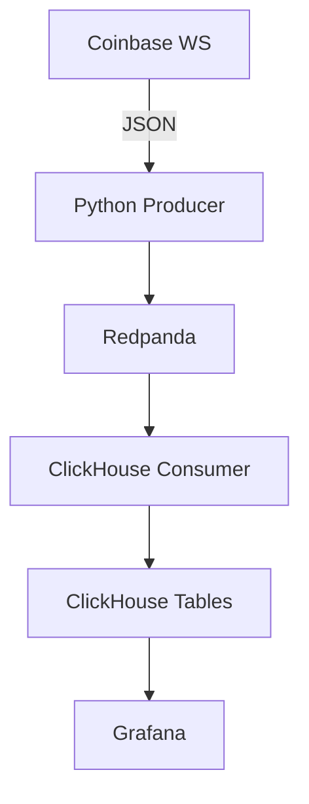

# Architecture Real-Time Crypto Analytics

## System overview

## Current Architecture

### Core Components
1. **Producer** (`coinbase_producer.py`)
   - Connects to Coinbase WebSocket
   - Streams JSON messages to Redpanda
   - Handles connection failures

2. **Consumer** (`clickhouse_consumer.py`)
   - Reads from Redpanda topics
   - Writes to ClickHouse tables
   - Basic data validation

3. **Storage**:
   - Create KafkaEngine table
   - Create MaterializedView
   - Create MergeTree tables

4. **Visualization**:
   - Pre-built Grafana dashboards
   - Real-time price tracking
   - Volume analytics
