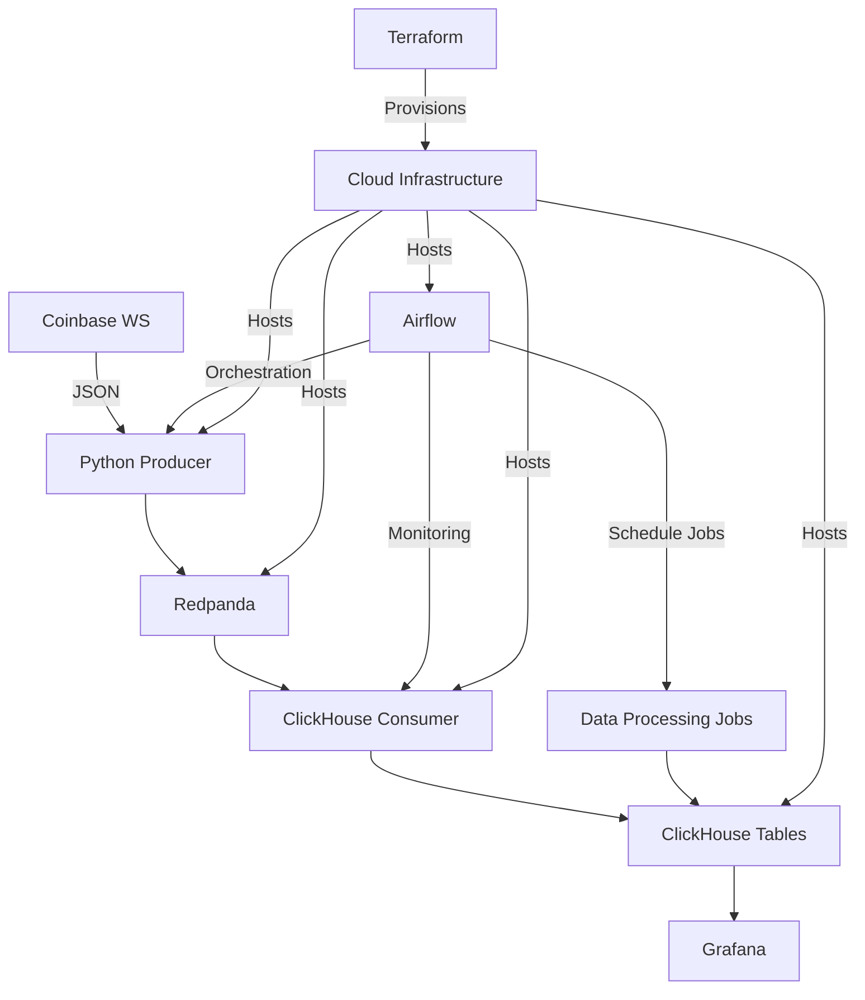

# Architecture Real-Time Crypto Analytics

## System overview

## Current Architecture

### Core Components
1. **Producer** (`coinbase_producer.py`)
   - Connects to Coinbase WebSocket
   - Streams JSON messages to Redpanda
   - Handles connection failures

2. **Consumer** (`clickhouse_consumer.py`)
   - Reads from Redpanda topics
   - Writes to ClickHouse tables
   - Basic data validation

3. **Storage**:
   - Create KafkaEngine table
   - Create MaterializedView
   - Create MergeTree tables

4. **Visualization**:
   - Pre-built Grafana dashboards
   - Real-time price tracking
   - Volume analytics

5. **Orchestration** (Apache Airflow):
   - Workflow scheduling and monitoring
   - DAG-based pipeline management
   - Data processing job coordination
   - System health checks
   - Error handling and notifications
   - Integration with existing components

6. **Infrastructure as Code** (Terraform):
   - Automated cloud provisioning (Yandex Cloud)
   - VM instances for Producer, Consumer, and Redpanda
   - Managed ClickHouse service
   - Object storage for data archiving
   - Networking and security configuration
   - Resource scaling management
   - Infrastructure state tracking

## Deployment Models

### Local Development
- Docker-based deployment
- LocalExecutor for Airflow
- Single-node Redpanda
- Standalone ClickHouse

### Cloud Production
- Terraform-managed infrastructure
- Managed Kubernetes for scalability
- Replicated Redpanda cluster
- ClickHouse cluster with sharding
- Separate virtual machines for each component
- S3-compatible object storage for backups 